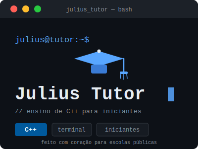

<div align="center">


  # Julius Tutor 🎓

  **Ensino de Programação em C++ | C++ Programming Teaching**

  <p>
    <a href="#-sobre-o-projeto-pt-br">🇧🇷 Português</a> |
    <a href="#-about-the-project-en-us">🇺🇸 English</a>
  </p>

  <!-- Badges -->
  
  
  
</div>

---

## 🇧🇷 Sobre o Projeto (PT-BR)

**Julius Tutor** é um projeto de extensão focado no ensino de programação básica utilizando **C++** de forma acessível para iniciantes absolutos. O foco deste material é atender pessoas que **nunca tiveram contato com programação**, aplicando a linguagem em problemas reais do dia a dia (como cálculos de médias e gráficos desenhados no próprio terminal em ASCII).

### 📸 Telas do Projeto (Screenshots)

<div align="center">
  
  <br/>
  <i>Exemplo de interação no terminal usando lógica básica.</i>
  <br/><br/>
  
  <br/>
  <i>Gráficos gerados no terminal durante o projeto final.</i>
</div>

### 🏗️ Arquitetura e Estrutura

O repositório foi construído com uma abordagem pedagógica progressiva, em que cada "módulo" contém aulas em formato de scripts iterativos que interagem com o aluno pelo terminal.

A arquitetura do código está dividida em 5 aulas progressivas mais o projeto final:

* 📁 **`modulo1_logica/`**: Introdução à lógica, matemática, tomada de decisão e loops.
  * `aula1_variaveis.cpp`: Introdução a variáveis e matemática básica (calculadora).
  * `aula2_decisao.cpp`: Tomada de decisão (`if` e `else`).
  * `aula3_repeticao.cpp`: Estruturas de repetição (`for` e `while`).
* 📁 **`modulo2_analise/`**: Dados e aplicações práticas.
  * `aula4_vetores.cpp`: Arrays e estatística básica (médias, somas).
  * `aula5_graficos_texto.cpp`: Visualização de dados usando ASCII.
  * `projeto_final_julius.cpp`: Aplicação final ("Julius Tutor"), um quiz interativo que gera gráficos de desempenho utilizando tudo o que foi aprendido.
* 📄 **`PLANO_DE_ENSINO.md`**: Detalhes completos sobre o plano pedagógico do curso.

### 🚀 Como Executar

Como o público-alvo são iniciantes (e muitas vezes sem acesso a computadores de alto desempenho), recomendamos o uso de ferramentas online para evitar configurações complexas.

**Recomendado (No Navegador):**
1. Acesse o [OnlineGDB (C++)](https://www.onlinegdb.com/online_c++_compiler) ou [Replit](https://replit.com/).
2. Copie o código da aula que deseja testar.
3. Clique em **Run** e interaja com o programa no console.

**Rodando Localmente na sua Máquina:**
1. Instale um compilador C++ (como o `g++` ou `clang`).
2. Clone este repositório e navegue até a pasta da aula:
   ```bash
   cd modulo1_logica
   ```
3. Compile o código:
   ```bash
   g++ aula1_variaveis.cpp -o aula1
   ```
4. Execute o programa gerado:
   ```bash
   ./aula1
   ```

---

## 🇺🇸 About the Project (EN-US)

**Julius Tutor** is an extension project focused on teaching basic programming using **C++** in an accessible way for absolute beginners. This material is designed for people who have **never had contact with programming**, applying the language to real-world everyday problems (like calculating averages and rendering terminal-based ASCII charts).

### 📸 Screenshots

<div align="center">
  
  <br/>
  <i>Example of terminal interaction using basic logic.</i>
  <br/><br/>
  
  <br/>
  <i>Charts generated in the terminal during the final project.</i>
</div>

### 🏗️ Architecture and Structure

The repository follows a progressive pedagogical approach. Each "module" contains lessons structured as iterative scripts that interact with the student via the terminal.

The code architecture is divided into 5 progressive lessons plus a final project:

* 📁 **`modulo1_logica/`**: Introduction to logic, math, decision making, and loops.
  * `aula1_variaveis.cpp`: Introduction to variables and basic math (calculator).
  * `aula2_decisao.cpp`: Decision making (`if` and `else`).
  * `aula3_repeticao.cpp`: Repetition structures (`for` and `while`).
* 📁 **`modulo2_analise/`**: Data and practical applications.
  * `aula4_vetores.cpp`: Arrays and basic statistics (averages, sums).
  * `aula5_graficos_texto.cpp`: Data visualization using ASCII.
  * `projeto_final_julius.cpp`: The final application ("Julius Tutor"), an interactive quiz that generates performance charts using everything learned.
* 📄 **`PLANO_DE_ENSINO.md`**: Complete details on the course's pedagogical teaching plan (in Portuguese).

### 🚀 How to Run

Since the target audience is absolute beginners, we highly recommend using online tools to avoid complex environment setups.

**Recommended (In Browser):**
1. Access [OnlineGDB (C++)](https://www.onlinegdb.com/online_c++_compiler) or [Replit](https://replit.com/).
2. Copy the code from the lesson you want to run.
3. Click **Run** and interact with the program in the console.

**Running Locally on Your Machine:**
1. Install a C++ compiler (such as `g++` or `clang`).
2. Clone this repository and navigate to the lesson's folder:
   ```bash
   cd modulo1_logica
   ```
3. Compile the code:
   ```bash
   g++ aula1_variaveis.cpp -o aula1
   ```
4. Execute the generated program:
   ```bash
   ./aula1
   ```

---
<div align="center">
  <i>Feito com ❤️ para alunos de Escolas Públicas / Made with ❤️ for Public School students</i>
</div>
